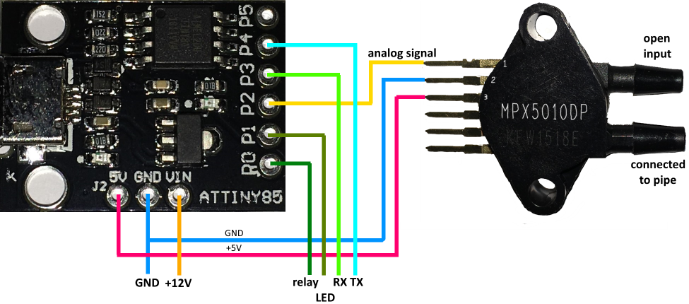
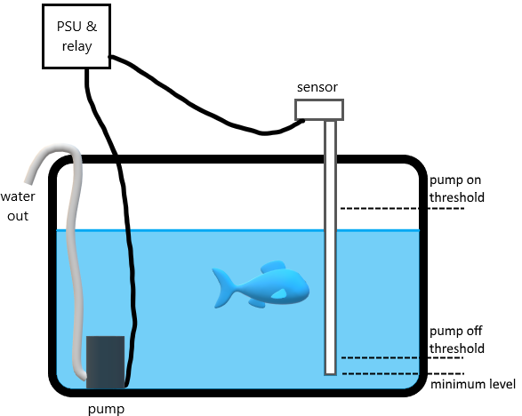

# Water Level Sensor 

Device for sensing water level in tank and controlling pump or valve. It includes Arduino sketch for ATtiny85 AVR microcontroller. 
When water level is above defined threshold, pump is on until water is out.

# Construction
Sensor device with its circuit is enclosed in hermetic case assembled on top of pipe. It connects to external power supply and relay that controls pump.
Main components:
* [MPX5010DP - pressure sensor](https://www.nxp.com/docs/en/data-sheet/MPX5010.pdf)
* [Digispark clone board with ATtiny85](https://i.stack.imgur.com/Iv2bq.png)

# Principles of operation
Water level is measured indirectly using air differential pressure sensor. The differential pressure sensor is installed on top of partially submerged pipe. The upper end of the pipe is closed by first sensor input (second input is open to atmosphere) while its bottom is submerged causing air trapped in the pipe to be squeezed proportionally to water height in the tank. Detailed description of the methodology is presented [here](http://www.ti.com/lit/an/snaa127/snaa127.pdf).

# Limitations:
Oxygen dissolves in water - what means that air which is trapped in measuring pipe could disappear slowly with time causing pressure reduction and lowering readings. Read more [here](https://en.wikipedia.org/wiki/Solubility).
To avoid this problem fresh air income to the pipe must be allowed from time to time. It could be done by actively pumping air to pipe or by opening its lower end. The simpler, second method is used in this sensor at expense of several limitations:
A) bottom end of the pipe needs to be above lowest water level to allow fresh air in,
B) if bottom end of the pipe is sunk for long time (when water level is growing slowly), water pump needs to be turned on to lower water level below bottom end of the pipe.

Limitation A is taken care by careful pump off threshold set and checking lowering water level when pump is on. Limitation B is handled by controller which turns on pump after its long inactivity.

# Safety
This device SHOULDN'T be used in critical applications where its wrong behaviour may result in somebodys death or injury or cause expensive damage.
The sensor has contact with water so it needs isolated power supply (SELV) located away from the sensor. The relay also needs to be away from sensor if it controls high voltage pump.
The device has built in safety routines to avoid pump working dry (timer limiting on time) and overflowing tank due to wrong measurement (oxygenation procedure) however for bigger tanks it is advised to consider additional precautions.
